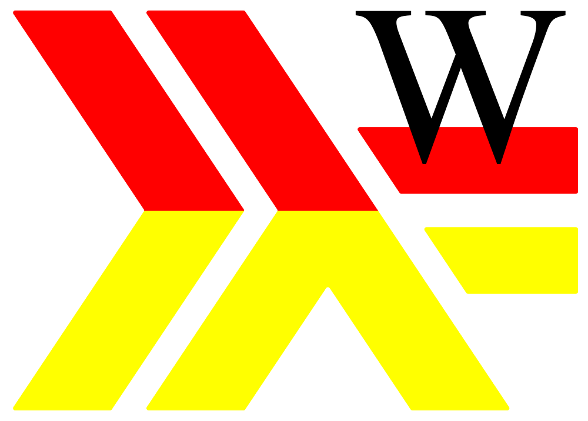
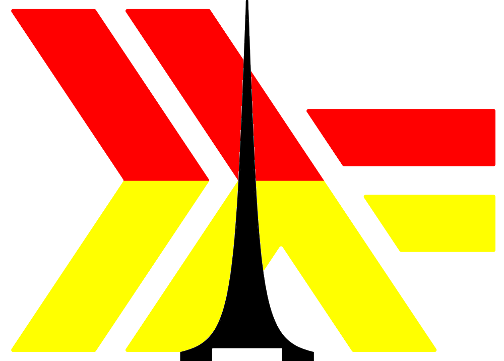
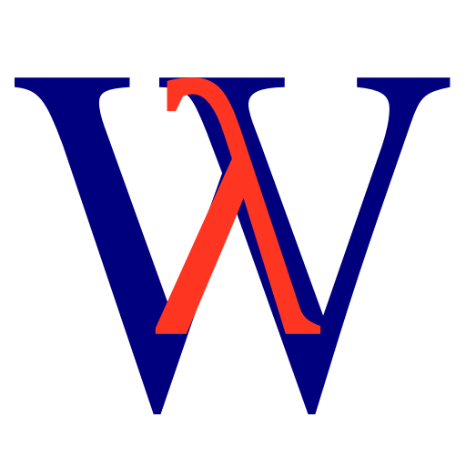
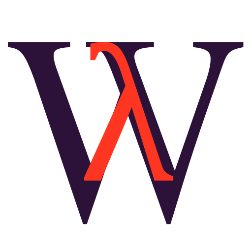
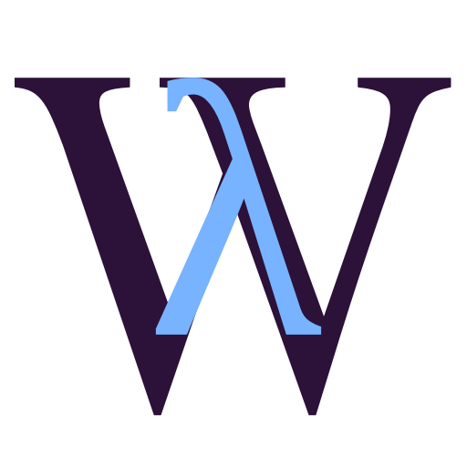
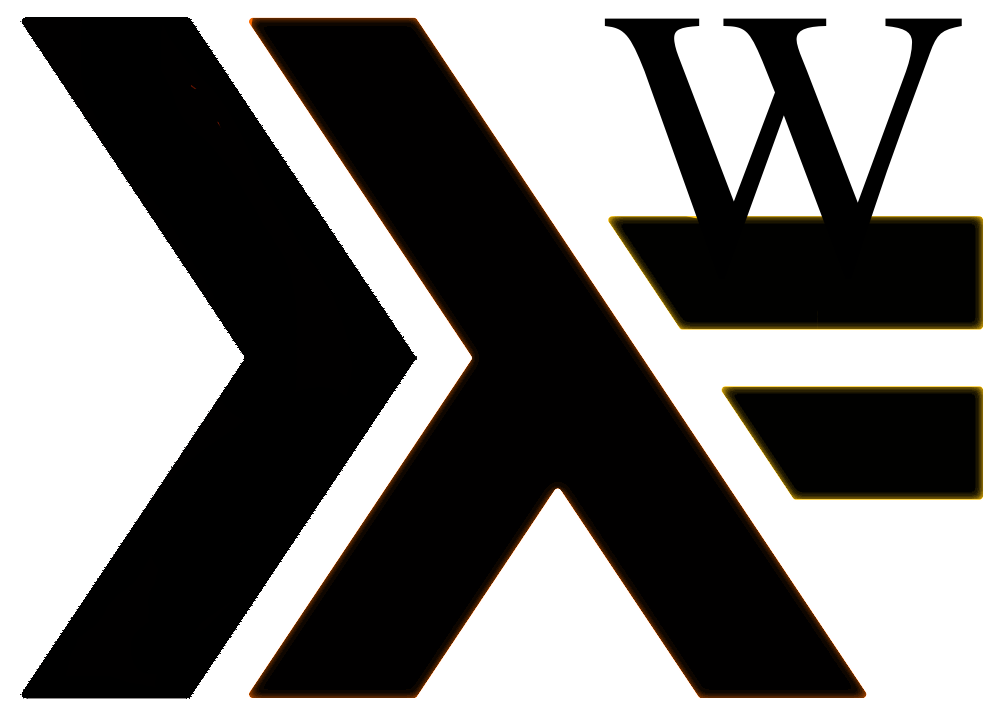

Functional Programming Wroclaw (https://www.meetup.com/Functional-Programming-Wroclaw/) resources
======================================================================================================

https://wiki.haskell.org/Haskell_logos
https://wiki.haskell.org/TW-Logo-Haskell

**The logo we currently use:**

This is the best we could made ourselves. If you (or any of your friends) have some graphics skills - we would be grateful for help!

## Logo proposals

Below you will find some logo variations that were created, but we decided not to use them.

<pre>
	
</pre>

<pre>
	
</pre>

<pre>
	
</pre>

<pre>
	
</pre>

<pre>
	
</pre>

<pre>
	
</pre>

<pre>
	
</pre>

<pre>
	
</pre>

<pre>
	
</pre>

<pre>
	
</pre>

